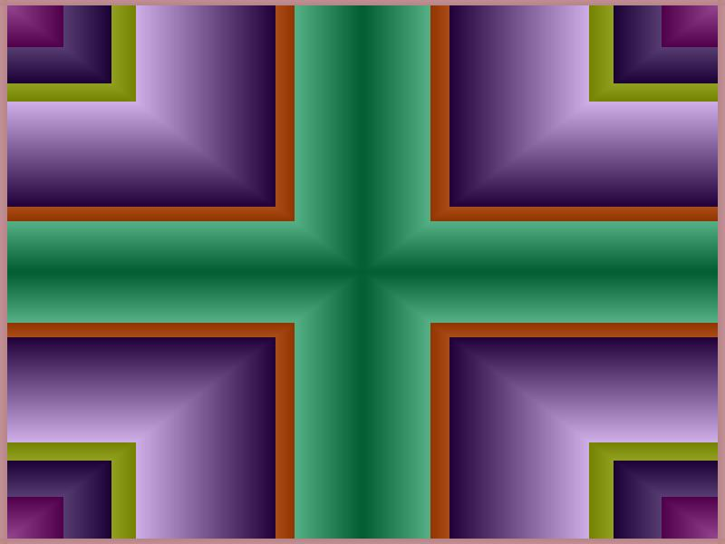



## Bar Screen Saver

### Description

Simple Bar Screen Saver.

I'm barely getting into graphics. so bare

with me :o)
 
### More Info
 
Compile the program and name it Bars.scr. copy it to c:\windows. Then you can check it out from display settings in control panel

             |
---                |---
**Submitted On**   |2001-05-02 11:28:24
**By**             |[Gabriel Martinez](https://github.com/Planet-Source-Code/PSCIndex/blob/master/ByAuthor/gabriel-martinez.md)
**Level**          |Beginner
**User Rating**    |4.0 (8 globes from 2 users)
**Compatibility**  |VB 6\.0
**Category**       |[Graphics](https://github.com/Planet-Source-Code/PSCIndex/blob/master/ByCategory/graphics__1-46.md)
**World**          |[Visual Basic](https://github.com/Planet-Source-Code/PSCIndex/blob/master/ByWorld/visual-basic.md)
**Archive File**   |[Bar Screen19109522001\.zip](https://github.com/Planet-Source-Code/gabriel-martinez-bar-screen-saver__1-22873/archive/master.zip)

